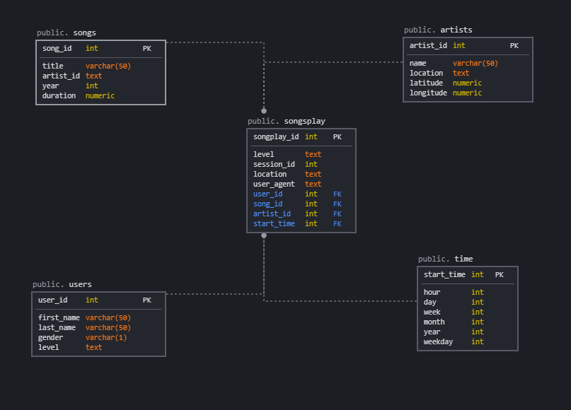

# Data Modeling with Postgres

A startup called Sparkify wants to create a Postgres database with tables designed to optimize queries on song play analysis. Currently data collected on songs and user activity are saved in JSON across a number of files. This project attempts to create a star schema to define fact and dimension tables focused on song play analytics, and develops an ETL pipeline that transfers data from files in two local directories into these tables in PostgreSQL using Python and SQL.

### Database Schema Design

The database is built using the Star schema data mart schema model. As per below model, the design has one fact table(songsplay) and four dimension tables (users, artists, songs, time).

### ETL Design

1. Create Tables:
- `create_tables.py` is used to drop and create the above tables.
2. Read, process and load data: 
- `etl.py` is used to read and process files from song_data and log_data folders, and loads data into respective tables using the sql queries defined in `sql_queries.py`

### Usage

Run the following commands from terminal:

1. `python create_tables.py`
2. `python etl.py`